# bypass-license-verification

### Intro

A little story about an Affect Effect plugin protected behind a license code check.
First of all, I won't provide any link to the AE project nor the place where I found the sources for obvious reasons.
This is a challenge and if you want to use a plugin you should support the author and buy it!

The idea is simple : I downloaded an After effect plugin which included a script to generate "pin point marker" on a flat map.

The problem is : You need to pay to use this plugin, and there is a license verification dialog when you try to use it.

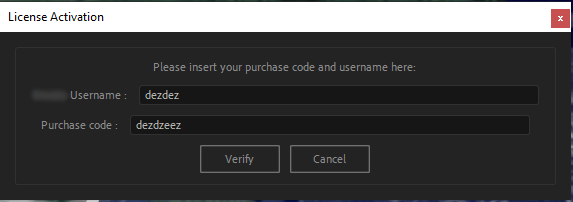


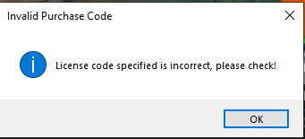

### JSXBIN

So I decided to take a look at the script code to understand what was going on and if I could "bypass" the verification.
And here is what it looks like ...

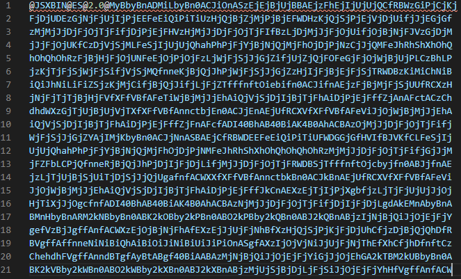

Opening it in an HexEditor or anything alike didn't change a thing.

But at the beginning of the file we can see `@JSXBIN@ES@2.0` ..

JSXBIN is a binary script created by ExtendScript Toolkit, a tool used to add extensions to Adobe Creative Suite applications.

It's like JavaScript but kind of... different and obfuscated :smiley: !

There is an awesome post about reversing JSXBIN here : https://www.scip.ch/en/?labs.20140515.
Unfortunaly even if you understand everything that is said in the blog post, you'd still need to "decompile" the script.
So I'm now looking for a JSXBIN to JSX converter.

### Decoding

I quickly came across this github project : https://github.com/autoboosh/jsxbin-to-jsx-converter
But it was since DMCA'd by Adobe https://github.com/github/dmca/blob/1dc576384cdcf2938aca792d83ad1921d30cc0ec/2016-03-11-Adobe.md

But thank god we are on the internet so it didn't take me long to find a mirror of the project.

Now the painful part... I needed to compile this project. :sleeping:

After a few tries with VSCode and installing a million different versions of .NET I finally surrendered and downloaded Visual Studio https://visualstudio.microsoft.com/vs/.

20Go and few hours later I am finally able to compile the project !

The program is fairly simple to run. Just write this command :
`jsxbin_to_jsx encodedInput.jsxbin decodedOutput.jsx`

And within seconds : 

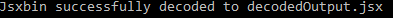

It is now time to open the script :

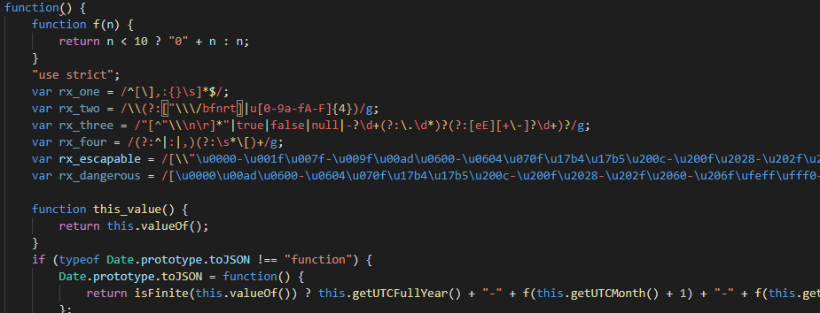

Looks like it's working, I can see the code !

But it looked too good to be true, and ... it was.

When trying to run the decoded script, After effect would throw an error to my face :

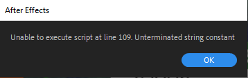

### Looking at the sources

Indeed, when looking closer at the decoded sources, some part could not be properly decrypted :

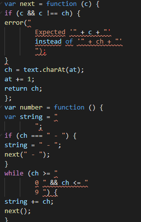

Even thought it was not perfect, it still allowed me to better understand how the script worked.
By searching the license validation error that I encoutered earlier I came across those 2 functions :


```js
function license_verify(license, client) {
    var data = $http({
        method: "POST",
        payload: {
            product_id: product_id,
            license_code: license,
            client_name: client,
            url: "http://example.com",
            ip: "127.0.0.1",
            agent: "none",
            verify_type: ""
        },
        url: server_url + "api/verify",
        headers: {
            "LB-API-KEY": lb_api_key
        }
    });
    if (data.payload.status == true) {
        alert(data.payload.message, "The purchased code is valid");
        return true;
    } else {
        alert(data.payload.message, "The purchased code is invalid");
        return false;
    }
}
```

and 

```js
function license_check(license, client) {
    var data = $http({
        method: "POST",
        payload: {
            product_id: product_id,
            license_code: license,
            client_name: client,
            url: "http://example.com",
            ip: "127.0.0.1",
            license_file: null
        },
        url: server_url + "api/check_license",
        headers: {
            "LB-API-KEY": lb_api_key
        }
    });
    if (data.payload.status == true) {
        startScript();
    } else {
        alert(data.payload.message, "The purchased code is invalid");
        settingsWin.show();
    }
}
```

The code is pretty simple :

The client does a request to `server_url + api/check_license` (or `api/verify`) and expects a `status` of `true` otherwise it'll throw an error.
We can find the server_url at the top of the file : `var server_url = "http://www.educational-url.com/license/";` _(The original URL has been replaced by this one)_

When opening the server URL, the web page only has a login form and nothing else in it :

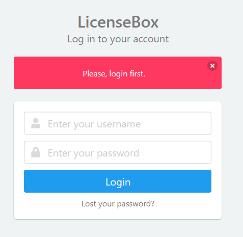

After a few failed login:password combinaison attempts (including the default credentials provided by the plugin demo page https://codecanyon.net/item/licensebox-php-license-and-updates-manager/22351237) I decided to look at the source code of the page.

Nothing very interesting here, I see that the form is protected against CSRF attacks (https://fr.wikipedia.org/wiki/Cross-site_request_forgery).
Makes me think that a standard SQL injection won't work as well.

But I still try to be extra sure ... no luck. I need to find another way !

### Investigating the domain

To better understand which requests are being made by the plugin I did a `nslookup` to get the IP address :

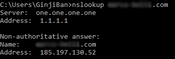

I can then set up Wireshark https://www.wireshark.org/ which is a network protocol analyzer.
By filtering on the domain's IP address, I can see every network calls being made.

I then run the After Effect script once again, to see the login dialog and the error message.
This is the wireshark result :

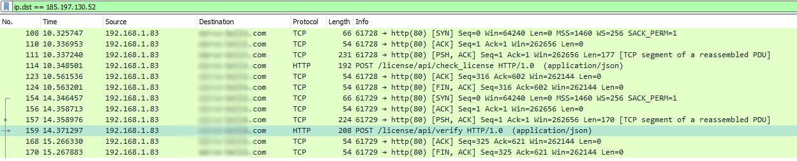

As we can see the 2 verification functions are both called.
Now I'm thinking ... what if I can "mimic" the server, what if I could return `true` whenever I wanted?

I originally thought I would do something like a MITM https://en.wikipedia.org/wiki/Man-in-the-middle_attack but since I only needed to redirect the traffic on my computer I could just do the trick with the DNS resolver !

In windows the `hosts` file is used to map hostnames to IP addresses. It is located under `C:\Windows\System32\drivers\etc`.

You can open it in plain text with notepad (make sure you have administrator rights)

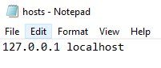

It looks like this : On the left you have the IP address that you want to be redirected on, and on the right the domain.
Here I want to redirect the license verification server to my own machine, so I'm doing :


```
127.0.0.1 localhost

127.0.0.1 educational-url.com
127.0.0.1 www.educational-url.com
```

Just save the file and the changes will be immediately live.

Now back to running the After Effect script :

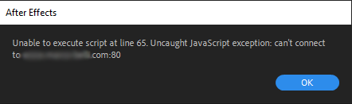

I don't see the login dialog anymore ! But I'm still not getting in, I guess when the server cannot be contacted it acts as a failure (it makes sense, as going offline would easily bypass the license check).

But at least I am making progress !

### Local server

Now why don't we host our own server ?
I can create a webserver locally on my machine and receive calls from any clients (including the script).

I chose to create a NodeJS (https://nodejs.org/) server with expressjs (https://expressjs.com/).

Thanks to wireshark (and the decoded source code) we know the two called endpoints are `/license/api/verify` and `/license/api/check_license`.
Now we just need to listen to these endpoints and return `status: true` to act like the verification process went OK and that the user can proceed.

The server code would look like this (It actually took me a lot of attempts to make this right, but here is the final version) :

```js
const express = require('express')
const app = express()

app.post('/license/api/verify', function (req, res) {
  console.log('verify endpoint called')
  res.send({
    status: true
  })
})

app.post('/license/api/check_license', function (req, res) {
  console.log('check_license endpoint called')
  res.send({
    status: true
  })
})

app.listen(80, function () {
  console.log('App listening on port 80!') // The 80 port is the default HTTP port. The domain is served with HTTP. Use 443 for HTTPS.
})
```

Firing up the server with `node server.js` ...

I'm now running the script for the 4th time and ...

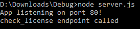

The server I created was called !

In fact, only `check_license` was called, it didn't even need to call `verify`

And I'm in ! :tada: No more dialog, no more login form, just the fully working pluging ! :tada:

Pretty neat, right ?

### Conclusion

By redirecting the traffic to my machine and by creating a webserver, I could easily bypass the license verification process.

I believe this method could be applied to the vast majority of license verification plugin.

Feel free to create an issue to comment this post, or provide an alternative method !

**Disclaimer : This post is for educational purposes ONLY. How you use this information is your responsability. I will not be held accountable for any illegal activities.**
